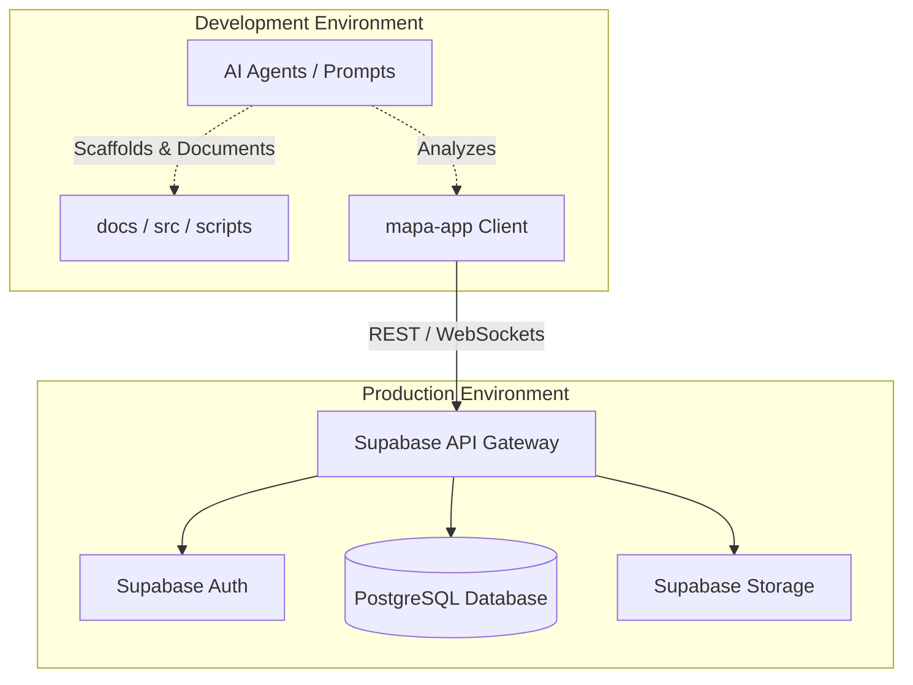

```markdown
<!-- agent-update:start:architecture-notes -->
# Architecture Notes

This document describes the structural design, system boundaries, and foundational decisions that shape the repository. The system integrates a primary application, a Backend-as-a-Service (BaaS) layer, and an AI-assisted development workflow.

## System Architecture Overview
The repository follows a modular monorepo structure comprising three primary pillars:
1. **Client Application (`mapa-app`)**: The main frontend/client application, likely built with a modern web or mobile framework (e.g., React/Next.js or React Native).
2. **Backend Services (`supabase`)**: Relies on Supabase for data persistence (PostgreSQL), authentication, and storage, minimizing custom backend boilerplate.
3. **AI-Assisted Tooling (`agents`, `prompts`)**: Incorporates an automated AI scaffolding and documentation system that maintains repository context, generates code, and updates guides.

Requests typically originate in the `mapa-app` client and are routed directly to Supabase endpoints via its client SDK. The AI tooling operates out-of-band as a development and CI/CD enhancement.

## Core System Components
- **`mapa-app/`**: The core application logic, UI components, and client-side state management (contains the bulk of the repository's files).
- **`supabase/`**: Configuration, migrations, and edge functions for the Supabase backend environment.
- **`src/`**: Shared TypeScript modules, business logic, or secondary services utilized by the application or tooling.
- **`agents/` & `prompts/`**: AI agent playbooks and prompt templates that drive automated codebase maintenance and documentation updates.
- **`scripts/` & `snippets/`**: Utility scripts for build processes, CI/CD pipelines, and reusable code fragments.
- **`docs/`**: Centralized repository documentation managed collaboratively by human developers and AI agents.

## Internal System Boundaries
- **Client vs. Server State**: The `mapa-app` domain strictly handles presentation and local state. All persistent, shared state and relational data integrity are delegated to the `supabase` PostgreSQL database.
- **Development Tooling vs. Production Code**: The `agents`, `prompts`, and `scripts` directories operate strictly in the development and deployment lifecycle and are not bundled into the production `mapa-app` build.

## System Integration Points
- **Supabase Client Integration**: `mapa-app` integrates with Supabase via REST APIs and WebSockets (for real-time subscriptions), handling authentication tokens and data querying.
- **AI Tooling Hooks**: The AI scaffolding tools hook into the repository via local scripts or CI pipelines, parsing `docs/` and `src/` to validate architectural constraints and maintain documentation freshness.

## External Service Dependencies
- **Supabase (BaaS)**: Provides PostgreSQL database, Authentication, and Edge Functions. *Considerations:* Requires management of row-level security (RLS) policies for data protection and monitoring of database compute limits.
- **LLM Provider (e.g., OpenAI/Anthropic)**: Powers the `agents/` and `prompts/` ecosystem. *Considerations:* API rate limits, context window constraints (especially given the 64k+ files in `mapa-app`), and prompt engineering stability.

## Key Decisions & Trade-offs
- **Using Supabase vs. Custom Backend**: Opted for a BaaS (Supabase) to accelerate feature delivery and reduce backend infrastructure overhead. *Trade-off:* Introduces vendor lock-in to the Supabase ecosystem, mitigated by standard PostgreSQL usage.
- **AI-Driven Documentation**: Adopted an AI-context scaffolding approach. *Trade-off:* Requires strict adherence to prompt structures and `agent-update` markers in markdown files to prevent context drift.
- **TypeScript Ecosystem**: Standardized on TypeScript (`tsconfig.json`, `jest.config.js`) across both the application (`mapa-app`) and tooling (`src`, `scripts`) to share types and interfaces.

## Diagrams



## Risks & Constraints
- **Repository Size & Dependency Bloat**: The `mapa-app` directory contains ~64,870 files, likely indicating a massive `node_modules` tree or heavy static assets. This poses a risk to CI build times and AI agent context limits.
- **Supabase Cold Starts**: If Edge Functions are utilized within the `supabase/` directory, cold start latency must be accounted for in user-facing flows.
- **Context Window Limits**: AI agents parsing the repository must rely on summarization scripts or targeted directory scanning to avoid exceeding LLM token limits when analyzing the 180MB repository.

<!-- agent-readonly:guidance -->
## AI Update Checklist
1. Review ADRs, design docs, or major PRs for architectural changes.
2. Verify that each documented decision still holds; mark superseded choices clearly.
3. Capture upstream/downstream impacts (APIs, events, data flows).
4. Update Risks & Constraints with active incident learnings or TODO debt.
5. Link any new diagrams or dashboards referenced in recent work.

<!-- agent-readonly:sources -->
## Acceptable Sources
- ADR folders, `/docs/architecture` notes, or RFC threads.
- Dependency visualisations from build tooling or scripts.
- Issue tracker discussions vetted by maintainers.

## Related Resources
- [Project Overview](./project-overview.md)
- Update [agents/README.md](../agents/README.md) when architecture changes.

<!-- agent-update:end -->
```
