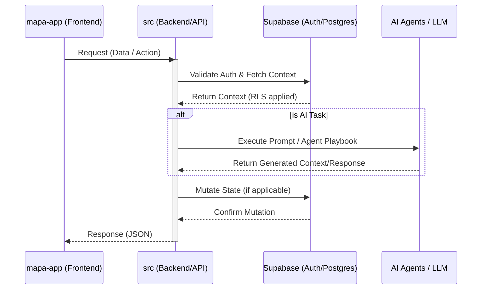

<!-- agent-update:start:data-flow -->
---
ai_update_goal: "Detail the system's data flow, internal module interactions, and external integrations."
required_inputs: ["High-level architecture diagram", "Supabase and AI integration details"]
success_criteria: ["Mermaid diagram included", "Internal movement documented", "External integrations defined with auth and retry strategies", "Observability and failure modes outlined"]
---

# Data Flow & Integrations

This document explains how data enters, moves through, and exits the system, including interactions between the frontend, core backend logic, database, and external AI services.

## High-level Flow

The primary data pipeline revolves around user interactions in the application (`mapa-app`), which are processed by the core logic (`src`), persisted in the database (`supabase`), and occasionally augmented by AI processes (`agents` and `prompts`).

## Internal Movement

The repository is structured as a monorepo, with distinct modules collaborating to handle application state and tooling:

*   **`mapa-app` (Client Layer)**: The user-facing application. It dispatches state updates and API requests using standard HTTP/REST or RPC calls to the backend. It relies on shared types defined in the workspace.
*   **`src` (Core Logic)**: Contains the central business logic, API route handlers, and data transformation services. It orchestrates calls between the database and the AI layer.
*   **`supabase` (Data Layer)**: Handles relational data storage, migrations, and user authentication. Internal communication with Supabase utilizes the Supabase JavaScript client, relying on JWTs for session management and Row Level Security (RLS) to restrict data access.
*   **`agents` & `prompts` (AI Layer)**: Playbooks and prompt templates used to instruct LLMs. `src` dynamically loads these prompts, injects runtime data context, and queues them for external processing.
*   **Scripts & Snippets (`scripts`, `snippets`)**: Utility routines that interact with the file system (`package.json`, `tsconfig.json`, `docs/`) for scaffolding, code generation, and repository maintenance.

## External Integrations

### 1. Supabase (BaaS)
*   **Purpose**: User authentication, relational database (PostgreSQL), and real-time subscriptions.
*   **Authentication**: Bearer tokens (JWT) passed via the `Authorization` header.
*   **Payload Shapes**: JSON payloads conforming to PostgREST specifications.
*   **Retry Strategy**: The Supabase client implements automatic exponential backoff for network failures. Database connection pooling is managed via Supabase's built-in PgBouncer/Supavisor.

### 2. Large Language Model (LLM) API (e.g., OpenAI / Anthropic)
*   **Purpose**: Powering the AI agents, generating documentation, and executing scaffolding tasks defined in the `agents/` directory.
*   **Authentication**: Secure API keys injected via environment variables (`process.env.OPENAI_API_KEY` or similar).
*   **Payload Shapes**: Standardized JSON message arrays (e.g., `[{ role: "system", content: "..." }, { role: "user", content: "..." }]`).
*   **Retry Strategy**: API calls are wrapped in a resilience layer that catches HTTP 429 (Rate Limit) and HTTP 50x errors, applying a jittered exponential backoff (up to 3 retries) before failing the job.

## Observability & Failure Modes

To ensure reliable data movement and system health, the following observability and resilience practices are in place:

*   **Metrics & Logs**: 
    *   Application logs are output to `stdout`/`stderr` and aggregated by the hosting provider.
    *   Supabase provides built-in dashboards for database query performance, API edge logs, and authentication events.
*   **Failure Modes & Compensating Actions**:
    *   *LLM Rate Limiting / Timeout*: If the AI provider is down or rate-limited, the system falls back to a graceful error state in the UI, prompting the user to retry. Dead-letter mechanisms are used for background AI tasks to ensure prompts are not lost.
    *   *Database Disconnects*: Handled by the connection pooler. If a mutation fails, the transaction is rolled back, and a 500-level error is surfaced to the client for a retry.
    *   *Client Offline*: `mapa-app` implements optimistic UI updates where applicable, reverting state if the network request ultimately fails.

<!-- agent-readonly:guidance -->
## AI Update Checklist
1. Validate flows against the latest integration contracts or diagrams.
2. Update authentication, scopes, or rate limits when they change.
3. Capture recent incidents or lessons learned that influenced reliability.
4. Link to runbooks or dashboards used during triage.

<!-- agent-readonly:sources -->
## Acceptable Sources
- Architecture diagrams, ADRs, integration playbooks.
- API specs, queue/topic definitions, infrastructure code.
- Postmortems or incident reviews impacting data movement.

<!-- agent-update:end -->
